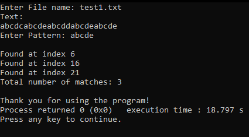
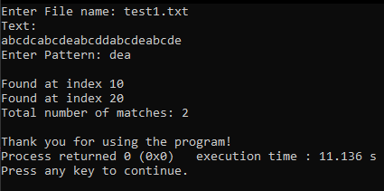
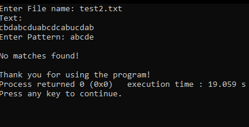

## PATTERN MATCHING
Knuth-Morris-Pratt algorithm for pattern matching is represented as a brute force algorithm.  Given a string of TEXT and a PATTERN, we begin matching characters in PATTERN with those in TEXT.  If the pattern matches, then we find an occurrence, otherwise a mismatch occurs. When such a mismatch occurs, we must backtrack to the beginning of PATTERN, shift one position to the right in TEXT, and start the search over again.

### Input
-      A file containing a string of text
-      a string of pattern

### Output
- Total number of occurrences of PATTERN in TEXT.  If no matches can be found, output “No matches found!”

### Sample Run
Test run #1

	

Test run #2

	

Test run #3

	

