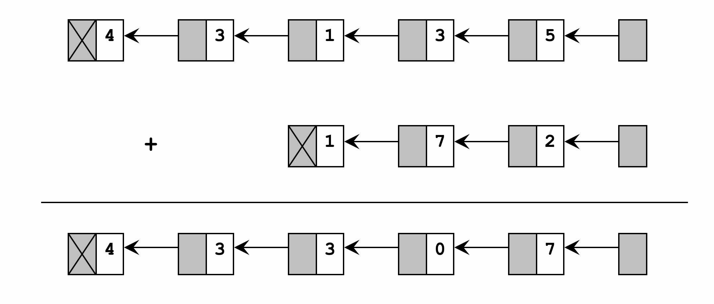

## Addition with Linked List

	

In most personal computers, the largest integer is 32,767 and the largest long integer is 2,147,483,647.  Some applications, such as the national debt, may require an unbounded integer.  One way to store and manipulate integers of unlimited size is by using a linked list. Each digit is stored in a node of the list.  For example, the figure below shows how we could store a five-digit number in a linked list.

While the linked list in the figure is represented as moving from right to left, remember that there is no physical direction in a linked list.  We represent it this way to assist us in understanding the problem.
 
To add two numbers, we simply add the corresponding digit in the same location in their respective linked lists with the carry from the previous addition.  With each addition, if the sum is greater than 10, then we need to subtract ten and set the carry to one.  Otherwise, the carry is set to zero.

Write a program to add two integer linked lists. Design your solution so that the same logic adds the first numbers (unit position) as well as the rest of the number. In other words, do not have special one-time logic for adding the unit position.
